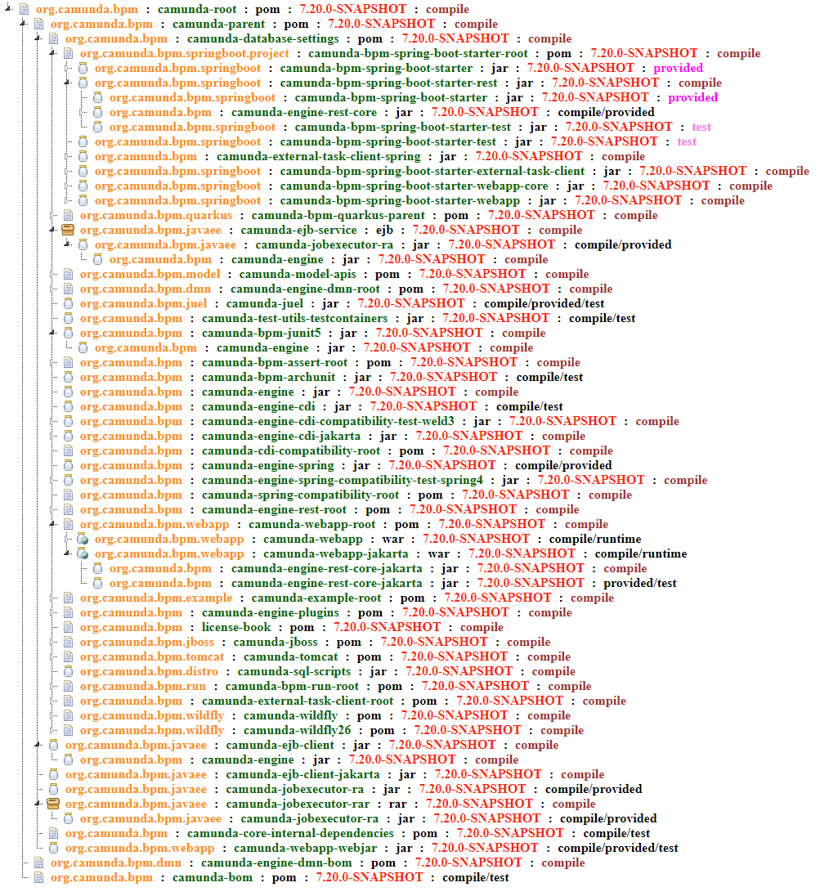
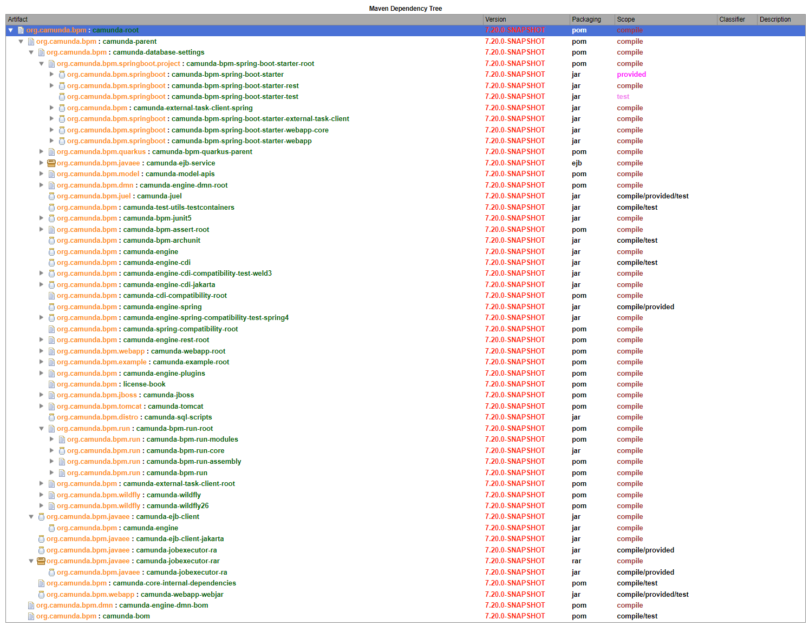

## Dependency graph as interactive tree

Run the following command on the Camunda Platform 7 repository (Windows notation, adjust to your OS and terminal accordingly):

```bash
mvn com.github.ferstl:depgraph-maven-plugin:3.3.0:aggregate -DmergeScopes=true -DgraphFormat=text -Dincludes=org.camunda.bpm* -Dexcludes=org.camunda.bpm.qa*,*:*qa* -DincludeParentProjects=true -DshowGroupIds=true -DshowVersions=true -DshowTypes=true
```

This creates a `dependency-graph.txt` in the `target` folder in the root of the repository.

Adjust this text as follows (replace `X` by the platform version you built):

* replace `7.X.0\-\d+\.\d+\-\d+` (regex) by `7.X.0-SNAPSHOT`
* replace `7.X.0-SNAPSHOT:jar` (no regex) by `jar:7.X.0-SNAPSHOT`
* replace `7.X.0-SNAPSHOT:war` (no regex) by `war:7.X.0-SNAPSHOT`
* replace `7.X.0-SNAPSHOT:rar` (no regex) by `rar:7.X.0-SNAPSHOT`
* replace `7.X.0-SNAPSHOT:ejb` (no regex) by `ejb:7.X.0-SNAPSHOT`
* replace `7.X.0-SNAPSHOT:zip` (no regex) by `zip:7.X.0-SNAPSHOT`
* replace `7.X.0-SNAPSHOT:pom` (no regex) by `pom:7.X.0-SNAPSHOT`

Copy this text file to the `src/main/resources` folder of this project.

Run the `Renderer` main class. This creates a temporary folder prefixed `depgraph` containing static resources and two HTML files `index_jstree.html` and `index_treetable.html`.

The `index_jstree.html` looks something like the following:



The `index_treetable.html` looks something like the following:

